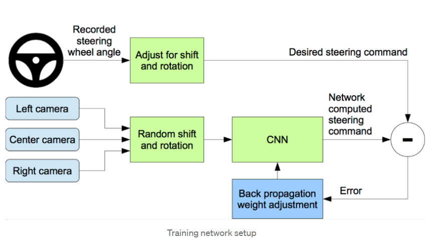
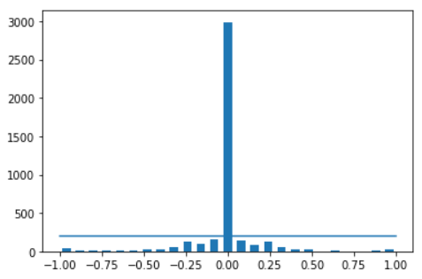
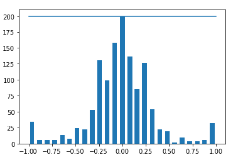
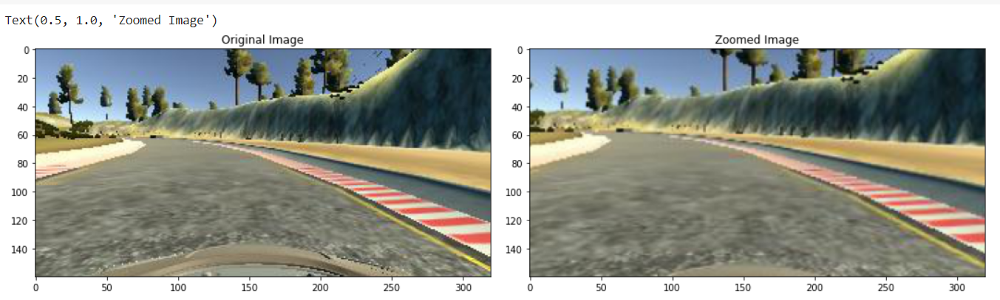
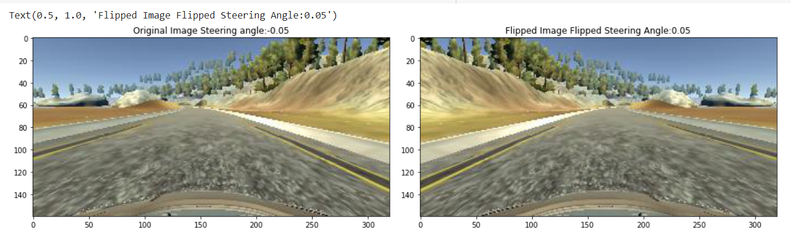

# Overview

## What's the Behavioral Clonning
Behavioral Clonning is a method by which human subcognitive skills can be captured and reproduced in a computer program. In this project I used behavioral cloning technique in shown below to train a neural network that can drive a car in Udacity Self Driving Car Simulation without hitting obstacles.

Data was collected with udacity self-driving car simulator. The Udacity simulator has two modes, training and autonomous, and two tracks. Training mode is to log the data for learning the driving behaviour. To do this I drove the car on track 1 keeping the car at centre of the lane and logged the data for 3 laps.

## Distribution Of Dataset

At first distribution of our dataset was more likely to predict 0 steering angle.Which means drive stragiht. This is called in machine learning area as bias. Biases can cause to focus our model mostly one value. In our project our bias was 0. We'd like to more balanced dataset to predict consistent values.

### Dataset Balancing

  
        remove_list = []
        for j in range(num_bins):
          list_ = []
          for i in range(len(data['steering'])):
            if data['steering'][i] >= bins[j] and data['steering'][i] <= bins[j+1]:
              list_.append(i)
            list_ = shuffle(list_)
            list_ = list_[samples_per_bin:]
            remove_list.extend(list_)
            
In this part firstly we defined an empty list called remove_list. We have nested loops. First loop iterates the length of the number of the bins. Which consists our steerings. At every iteration, we define an empty list to balance our data by removing values that remain above a certain threshold. In our example, this threshold can be considered 200. After we applied this operation 1463 data is remained. After implementing this code we obtained following result.

As we can see now our dataset is more uniformed. After removing some part of data it remained ~1263 image. Which is not very enough. We are going to implement data augmentation technique to augment our dataset and prevent to overfitting.

## Data Augmentation

Data augmentation is a set of techniques to artificially increase the amount of data by generating new data points from existing data. This includes making small changes to data or using deep learning models to generate new data points. I used to techniques such as zooming, panning, changing brightness of image, flipping image etc. Here are the some examples below.

### Zooming

        def zoom(img):
          zoom=iaa.Affine(scale=(1,1.3))
          image=zoom.augment_image(img)
          return image

This method applies random zooming in range 1,1.3. Here are the some zoomed image samples.

### Flipping

        def img_random_flip(image,steering_angle):
          image=cv2.flip(image,1)#Horizontal Flip
          steering_angle=-steering_angle
          return image,steering_angle

Flipping is a static or moving image that is generated by a mirror-reversal of an original across a horizontal axis. This method flips our image and changes our steering angle.

