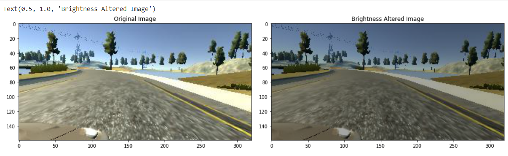
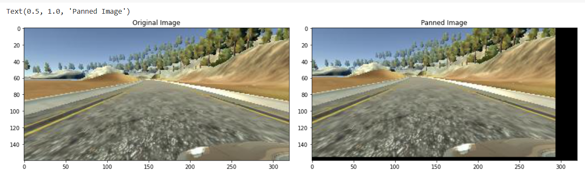

# Overview

https://user-images.githubusercontent.com/78471151/177855820-f37de60a-32e8-4c5f-9803-f0845d49dc00.mp4

## What's the Behavioral Clonning
Behavioral Clonning is a method by which human subcognitive skills can be captured and reproduced in a computer program. In this project I used behavioral cloning technique in shown below to train a neural network that can drive a car in Udacity Self Driving Car Simulation without hitting obstacles.

Data was collected with udacity self-driving car simulator. The Udacity simulator has two modes, training and autonomous, and two tracks. Training mode is to log the data for learning the driving behaviour. To do this I drove the car on track 1 keeping the car at centre of the lane and logged the data for 3 laps.

## Distribution Of Dataset

At first distribution of our dataset was more likely to predict 0 steering angle.Which means drive stragiht. This is called in machine learning area as bias. Biases can cause to focus our model mostly one value. In our project our bias was 0. We'd like to more balanced dataset to predict consistent values.

### Dataset Balancing

  
        remove_list = []
        for j in range(num_bins):
          list_ = []
          for i in range(len(data['steering'])):
            if data['steering'][i] >= bins[j] and data['steering'][i] <= bins[j+1]:
              list_.append(i)
            list_ = shuffle(list_)
            list_ = list_[samples_per_bin:]
            remove_list.extend(list_)
            
In this part firstly we defined an empty list called remove_list. We have nested loops. First loop iterates the length of the number of the bins. Which consists our steerings. At every iteration, we define an empty list to balance our data by removing values that remain above a certain threshold. In our example, this threshold can be considered 200. After we applied this operation 1463 data is remained. After implementing this code we obtained following result.

As we can see now our dataset is more uniformed. After removing some part of data it remained ~1263 image. Which is not very enough. We are going to implement data augmentation technique to augment our dataset and prevent to overfitting.

## Data Augmentation

Data augmentation is a set of techniques to artificially increase the amount of data by generating new data points from existing data. This includes making small changes to data or using deep learning models to generate new data points. I used to techniques such as zooming, panning, changing brightness of image, flipping image etc. Here are the some examples below.

### Zooming

        def zoom(img):
          zoom=iaa.Affine(scale=(1,1.3))
          image=zoom.augment_image(img)
          return image

This method applies random zooming in range 1,1.3. Here are the some zoomed image samples.

### Flipping

        def img_random_flip(image,steering_angle):
          image=cv2.flip(image,1)#Horizontal Flip
          the steering_angle=-stee,ring_angle
          return image,steering_angle

Flipping is a static or moving image that is generated by a mirror-reversal of an original across a horizontal axis. This method flips our image and changes our steering angle.

### Changing Brightness Of An Image

        def img_random_brightness(img):
          brightness=iaa.Multiply((0.2,1.2))the the 
          image=brightness.augment_image(img)
          return image

Adjusting brightness, contrast and hue of image is a common image augmentation method widely used in image processing. The method changes image's brightness value randomly in range 0.2 and 1.2.

### Panning

        def pan(img):
          pan=iaa.Affine(translate_percent={"x":(-0.1,0.1),"y":(-0.1,0.1)})
          img=pan.augment_image(img)
          return img
        
It pans images from x and y coordinates randomly in ithe n range -0.1,0.1. 

### Random Augmentation

        def random_augment(image, steering_angle):
            image = mplim.imread(image)
            if np.random.rand() < 0.5:
              image = pan(image)
            if np.random.rand() < 0.5:
              image = zoom(image)
            if np.random.rand() < 0.5:
              image = img_random_brightness(image)
            if np.random.rand() < 0.5:
              image, steering_angle = img_random_flip(image, steering_angle)

            return image, steering_angle

This method applies to our images and steering_angles random augmentations. We are going to use this method in our Batch Generator.

## Train And Validation Data Splitting

        def load_img_steering(datadir, df):
          image_path = []
          steering = []
          for i in range(len(data)):
            indexed_data = data.iloc[i]
            center, left, right = indexed_data[0], indexed_data[1], indexed_data[2]
            image_path.append(os.path.join(datadir, center.strip()))
            steering.append(float(indexed_data[3]))
            # left image append
            image_path.append(os.path.join(datadir,left.strip()))
            steering.append(float(indexed_data[3])+0.15)
            # right image append
            image_path.append(os.path.join(datadir,right.strip()))
            steering.append(float(indexed_data[3])-0.15)
          image_paths = np.asarray(image_path)
          steerings = np.asarray(steering)
          return image_paths, steerings
          
Firstly we defined a method that loads images and corresponding steering angles. In this meth, od we have empty image_path and steering lists. We will fill thalistts with corresponding image paths and steering_angles. For every iteration, on we select ith data. From this da, ta we arseparatingng center, left and right image's path. After that, we append that image_path and steering angle. At the end of the meth, od we return image_paths and steerings NumPy array.

        image_paths, steerings = load_img_steering(path + '/IMG', data)
        X_train, X_valid, y_train, y_valid = train_test_split(image_paths, steerings, test_size=0.2, random_state=6)
 
We split our data by using train_test_split method from sklearn library. We adjusted our test_size ratio as 0.2. Which is most of the time a good test size value.

 

Seems like our training and validation data is consistent with each other.

## Image Preprocessing

Image preprocessing are the steps taken to format images before they are used by model training and inference. This includes, but is not limited to, resizing, orienting, and color corrections.

      def img_preprocess(image_to_preprocess):

          image_to_preprocess = image_to_preprocess[60 : 135,:,:]
          image_to_preprocess = cv2.cvtColor(image_to_preprocess, cv2.COLOR_RGB2YUV)
          image_to_preprocess = cv2.GaussianBlur(image_to_preprocess,  (3, 3), 0)
          image_to_preprocess = cv2.resize(image_to_preprocess, (200, 66))
          image_to_preprocess = image_to_preprocess/255
          return image_to_preprocess

img_preprocess() method takes one argument. Which is image to preprocess. At first we crop image that part of we don't need to extract it's features. Such as front of a car. We cropped that part. Then we convert  

