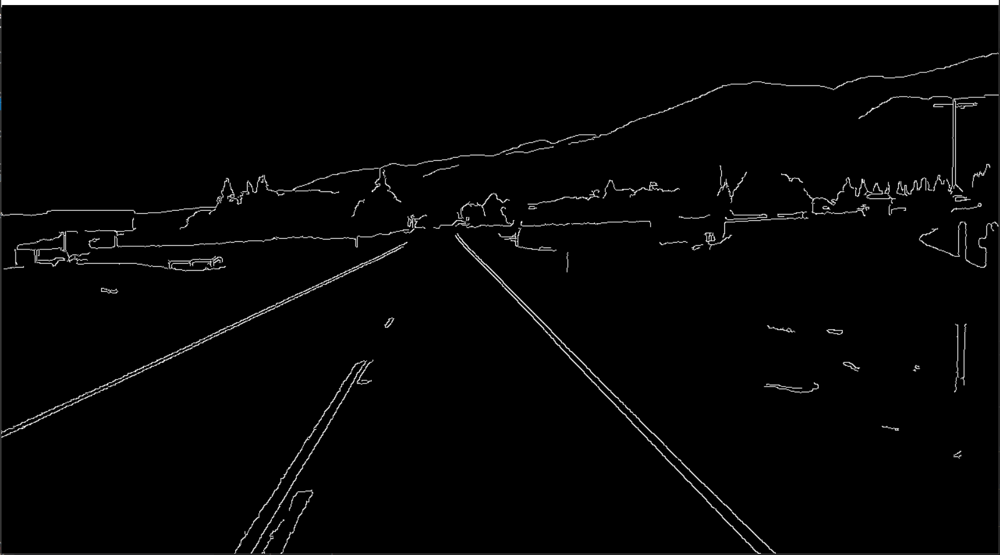

# Detecting Lane Lines On Video

## Overview
When we drive, we use our eyes to decide where to go. The lines on the road that show us where the lanes are act as our constant reference for where to steer the vehicle. Naturally, one of the first things we would like to do in developing a self-driving car is to automatically detect lane lines using an algorithm.  
In this project I will go throught the steps needed to succesfully detect lane lines in images and in a video stream using Python and OpenCV. The pipline for line identification takes road images from a viedo as input and returns an annotated video stream as output.

  Some of the Technologies used in this study:<b>Python,OpenCV,Numpy,Matplotlib</b>  
 The study consists of 5 steps: 
 <ul>
 <li>Edge Detection with Canny Image Detector</li>
 <li>Region Of Interest Selection</li>
 <li>Line Detection by Hough transformation</li>
 <li>Lines averaging and extrapolation</li>
 </ul>
  
 
## Edge Detection with Canny Image Detector

	   
	   def canny(img):
    	   gray = cv2.cvtColor(img, cv2.COLOR_RGB2GRAY)
    	   kernel = 5
    	   blur = cv2.GaussianBlur(gray,(kernel, kernel),0)
    	   canny = cv2.Canny(gray, 50, 150)
    	   return canny
       
In this section we've created a method that convert image to canny image in order to detect edges in image.  Edge detection is an image processing technique for finding the boundaries of objects within images. It works by detecting discontinuities in brightness. 
After  applying canny() method to image I obtained following result.

 
 
